## ASP.NET Core – Engitel S.p.A. – Car Dealership Management MVC Application
Project developed using ASP.NET MVC (.NET Framework), this application provides
a structured system for managing calendar-based appointments linked to families
and their vehicles. The platform enforces strict business rules at both database
and application layers and implements a multi-step wizard workflow with deferred
persistence to ensure data consistency and user confirmation.

The system follows a layered architecture with Controllers, Services, Entity
Framework (Database First), and strongly typed ViewModels. It is designed with
realistic enterprise patterns in mind, including transactional integrity,
session-based workflows, and relational constraints.

---
## 🛠️ Technologies Used

- **ASP.NET MVC 5** – Web framework (Model-View-Controller)
- **.NET Framework** – Runtime platform
- **Entity Framework 6** – ORM (Database First)
- **SQL Server** – Relational database
- **Razor** – Server-side templating engine
- **Bootstrap** – UI layout and styling
- **jQuery** – Client-side scripting

---
## 🏗️ Architecture Overview

The application follows a classic layered MVC architecture:
- Controllers
  Handle HTTP requests, manage wizard flow, validate user input, and delegate
  business logic to services.
- Services Layer
  Encapsulates domain logic, enforces business rules, and manages persistence.
  Exposed via interfaces to support loose coupling and testability.
- Models
  - Database entities generated via Entity Framework (DB First)
  - ViewModels used for form binding, validation, and UI representation
- Views
  Strongly typed Razor views implementing wizard-style forms and calendar UI.

---
## 🔁 Entity Framework Usage

- Database First approach
- Navigation properties used for relationships
- Explicit Include() for eager loading
- Asynchronous queries (async / await)
- EF manages transactions automatically per SaveChanges() call, if you want use multiple SaveChanges within the same open connection, wrap all in a explicit Trasaction.

---
## 🛡️ Validation & Error Handling

- ViewModel-based validation
- Server-side validation via ModelState
- Business rule violations surfaced as model-level errors
- Anti-forgery tokens used for all POST actions

---
## ▶️ Running the Application

Prerequisites:
- Visual Studio
- SQL Server
- .NET Framework installed

Steps:
1. Restore NuGet packages
2. Configure connection string in Web.config
3. Run database script to create schema (**./docs/scripts/scriptDB.sql**)
4. Start application via Visual Studio (IIS Express)

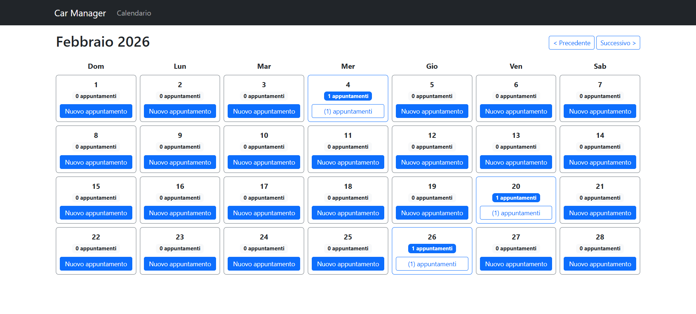

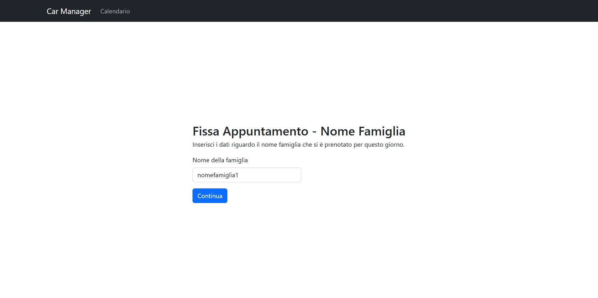
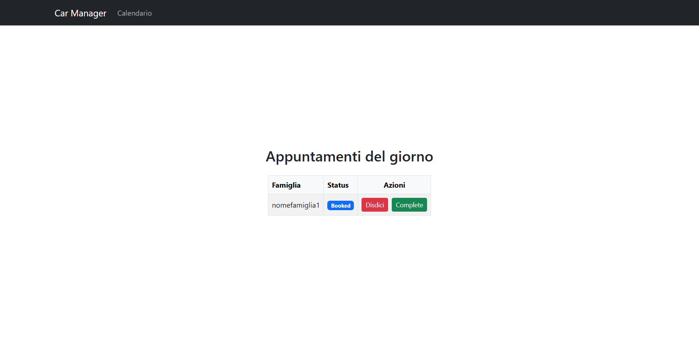

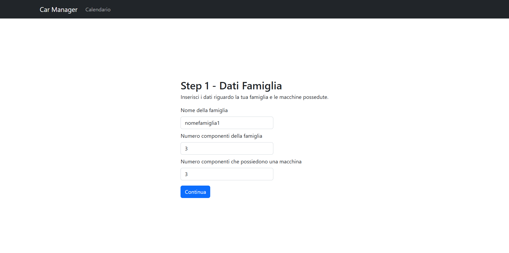
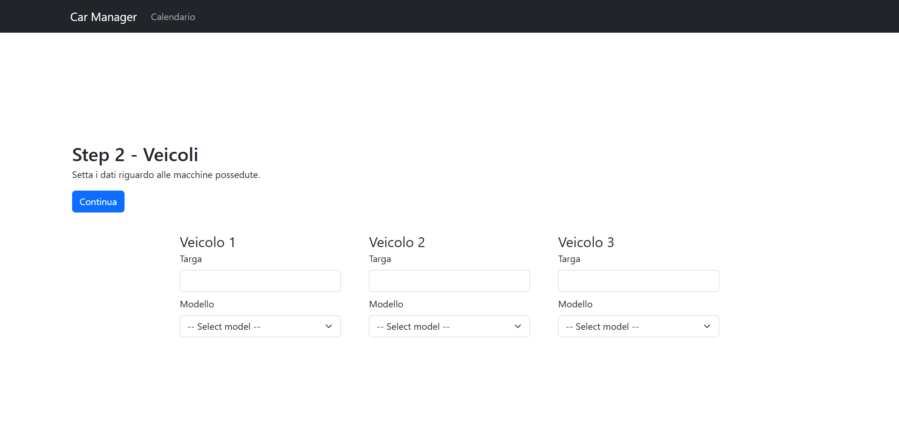
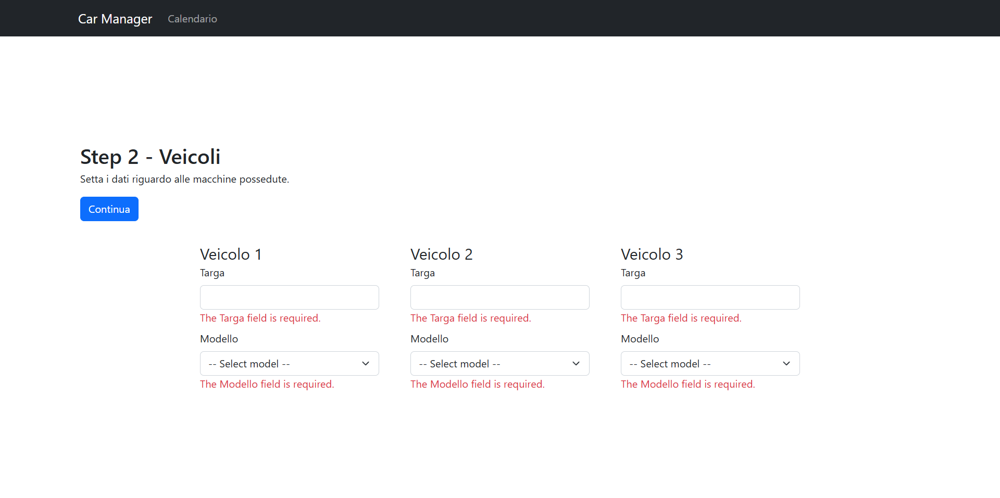
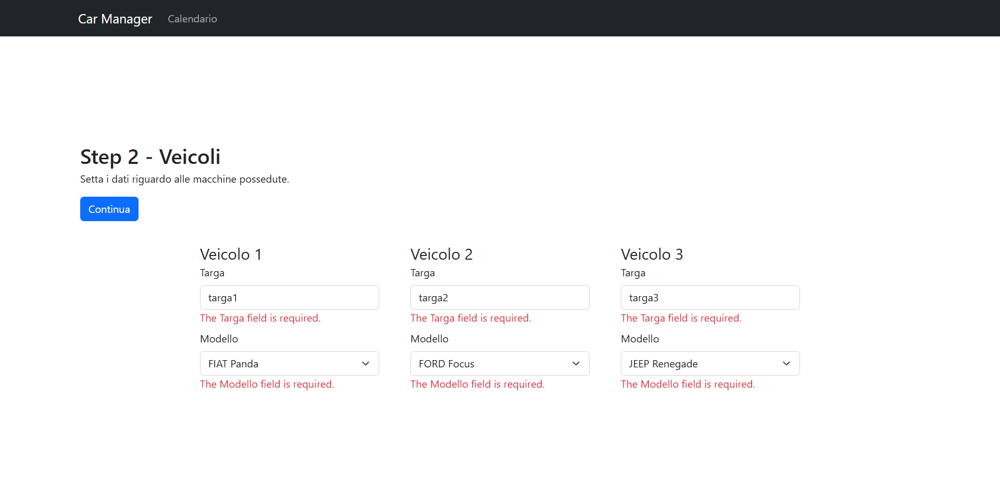
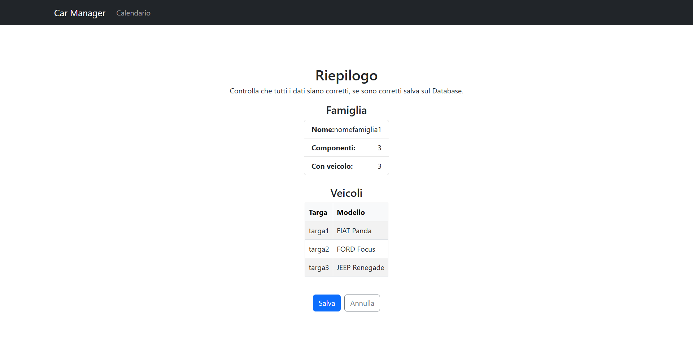
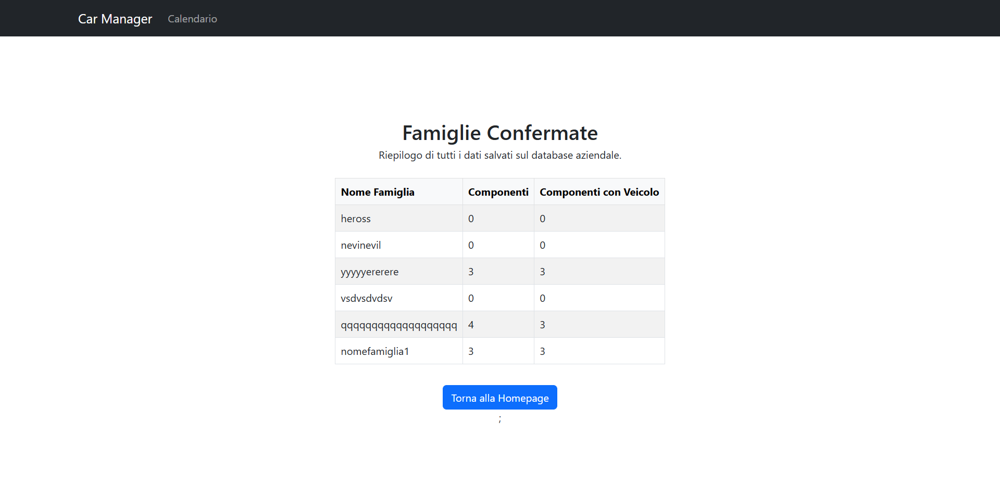
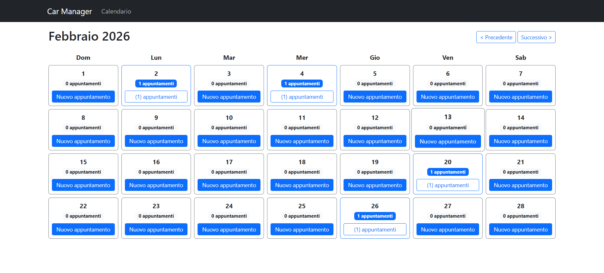
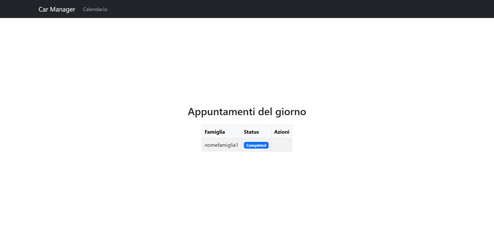

